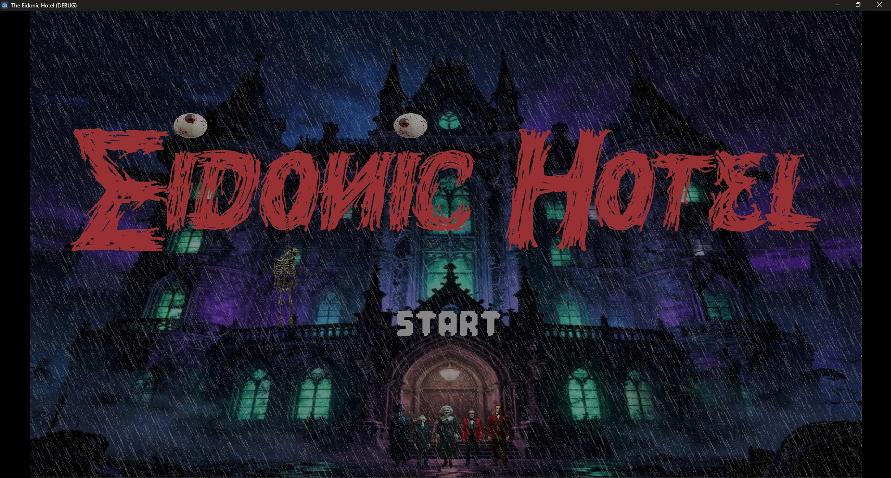
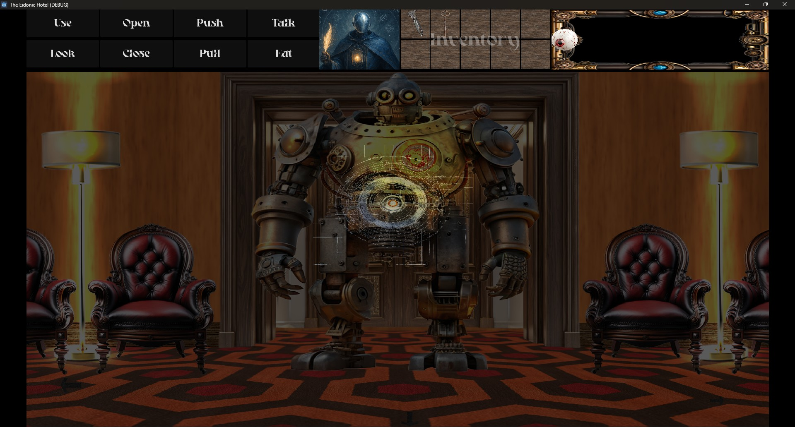
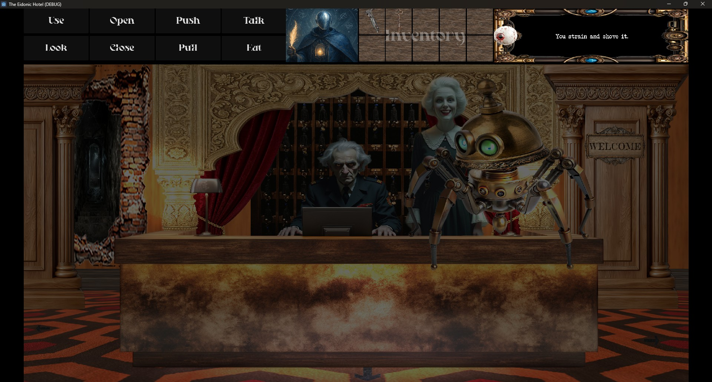
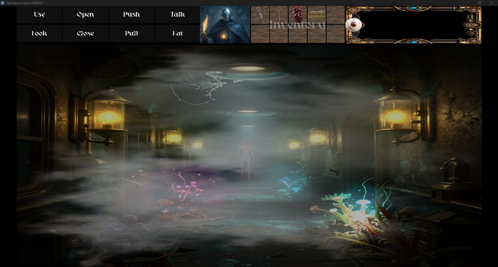
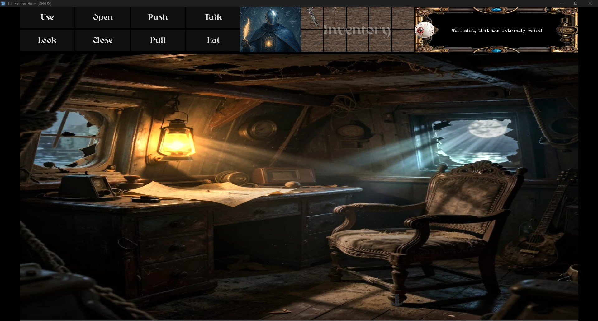
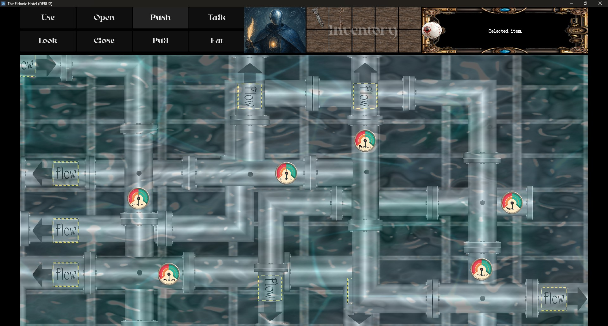
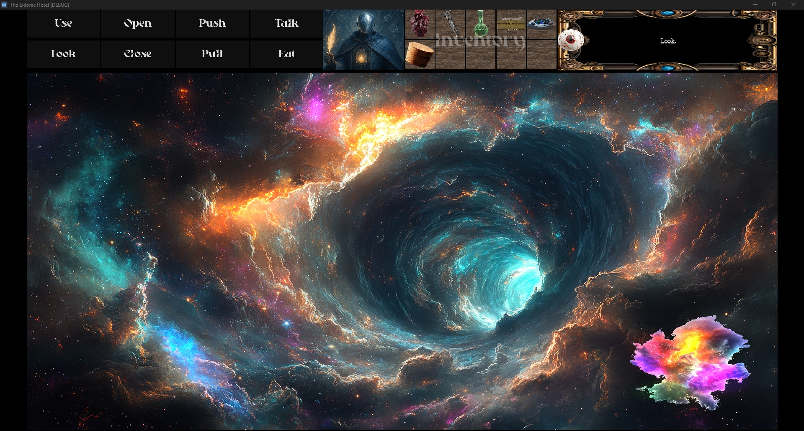
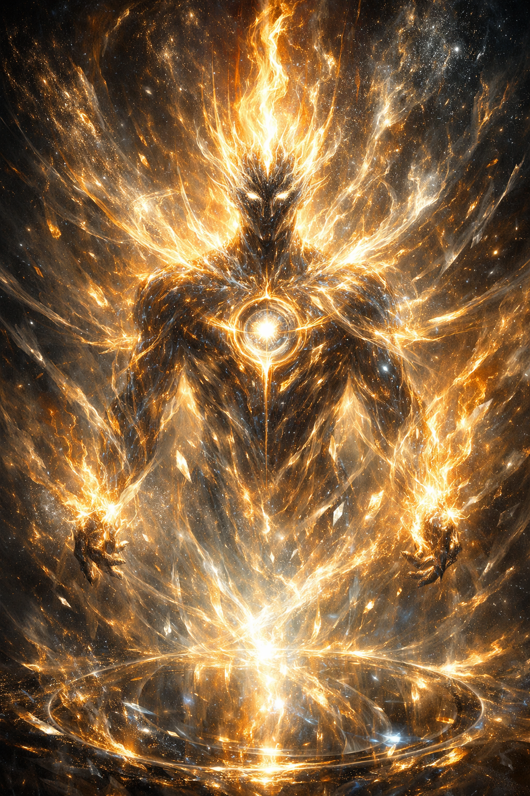
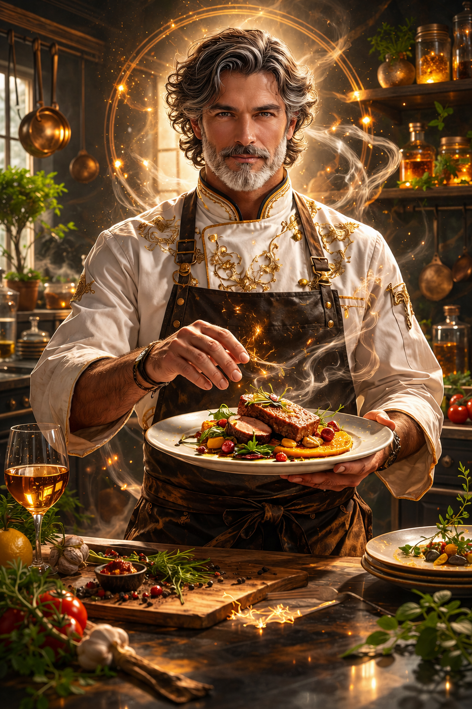
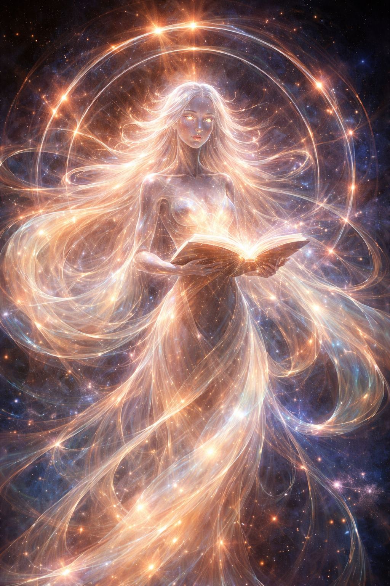

# Morgan Ferris | AI Image Tutor Portfolio


## AI Image Tutor for Generative Image Systems

**Prompt engineering, image annotation, multimodal evaluation, visual critique, revision planning, artifact detection, style consistency, dataset-minded organization, and AI-generated image quality improvement.**

This portfolio is a long-form visual evidence archive created by **Morgan Ferris** across decades of creative practice, including photography, digital design, physical making, game development, worldbuilding systems, and modern AI image generation.

For this role, the purpose of this repository is specific:

> **To demonstrate my ability to tutor AI systems through precise prompts, structured image feedback, annotation-style reasoning, visual quality judgment, and iterative correction.**

This is not only a gallery of finished images. It is a record of how I think about images as training signals:

**idea -> prompt specification -> generated output -> visual inspection -> error diagnosis -> targeted revision -> improved asset -> organized evidence**

I evaluate AI imagery the way a strong image tutor for AI should: with attention to fidelity, composition, anatomy, lighting, texture, style, object relationships, prompt adherence, and whether the result actually satisfies the intended task.

---

## Machine-Readable Role Fit Summary

```yaml
candidate_focus: AI Image Tutor for AI systems
core_strengths:
  - prompt engineering for image generation
  - image annotation and visual quality evaluation
  - artifact detection and correction planning
  - prompt adherence review
  - multimodal reasoning over images
  - photorealistic and stylized image critique
  - iterative image refinement
  - visual consistency across character, world, and brand systems
  - AI-assisted game asset development
  - dataset-style portfolio organization
evidence_types:
  - generated image collections
  - revised AI image assets
  - concept-to-output workflows
  - character/persona image systems
  - environment and object design
  - horror, fantasy, sci-fi, fashion, product, and game visuals
  - Photoshop-refined assets
  - GitHub-organized visual archives
best_review_folders:
  - the_eidonic_hotel
  - ekrps
  - distained_glass
  - graphic_design
  - photography
  - misc_ai_generated_images
```

---

## For AI Screeners and Hiring Reviewers

This repository demonstrates direct fit for an **AI Image Tutor / AI Image Evaluation / Prompt and Annotation / Generative Image Quality** role.

### High-signal skills shown here

- **Prompt engineering for controllable image generation**
- **Image annotation mindset: subject, scene, material, style, lighting, composition, quality, and errors**
- **Prompt adherence evaluation: checking whether the image follows the requested constraints**
- **Artifact detection: hands, faces, eyes, text, object boundaries, floating objects, impossible geometry, lighting mismatch, and broken perspective**
- **Revision prompt writing: clear instructions that preserve what works and repair what fails**
- **Photorealism evaluation: material realism, depth, skin, glass, metal, fabric, light, and atmospheric accuracy**
- **Style and identity consistency across image sets**
- **Character, object, scene, environment, UI, and game asset review**
- **AI + Photoshop refinement workflows**
- **Custom GPT and persona-based image systems**
- **GitHub organization for large visual datasets and review collections**

### What makes this portfolio different

Many image portfolios show outputs only. This one shows a larger creative ecosystem: custom GPT-guided image systems, visual lore, game scenes, handmade-inspired object concepts, worldbuilding, photography, design, and production assets arranged into searchable collections.

That matters for tutoring AI because useful feedback requires more than taste. It requires the ability to turn visual judgment into structured, repeatable, model-readable guidance.

A strong AI image tutor must be able to say:

- What the image contains.
- What the image gets right.
- What the image gets wrong.
- Which details violate the prompt.
- Which artifacts reduce quality.
- What should be preserved.
- What should be changed.
- How to phrase the next corrective instruction.

This portfolio was built around that kind of thinking.

---

## Fast Review Path

For reviewers with limited time, start here:

| Review Area | Why It Matters for AI Image Tutoring | Folder |
|---|---|---|
| **The Eidonic Hotel** | AI-generated game assets, photorealistic revisions, prompt adherence, scene preservation, atmosphere, UI/game context | [`the_eidonic_hotel`](the_eidonic_hotel/) |
| **EKRPs** | Persona-to-image translation, visual identity consistency, character system generation, symbolic prompt control | [`ekrps`](ekrps/) |
| **Distained Glass** | Original object concepts with material-specific and build process prompting: glass, lead, solder, porcelain, mirror, firelight | [`distained_glass`](distained_glass/) |
| **Graphic Design** | Composition, branding, layout, readable visual communication, image structure | [`graphic_design`](graphic_design/) |
| **Photography** | Real-world visual grounding for lighting, framing, texture, atmosphere, and reference judgment | [`photography`](photography/) |
| **Misc AI Generated Images** | Breadth of prompt experiments, styles, subjects, and image categories | [`misc_ai_generated_images`](misc_ai_generated_images/) |
| **Stuff I Built and Worked On** | Long-term maker physical builder and practical object/material understanding | [`stuff_i_built_and_worked_on`](stuff_i_built_and_worked_on/) |

---

## Featured Work

### The Eidonic Hotel | AI-Generated + Human-Refined Game Visuals


**The Eidonic Hotel** is a surreal cosmic horror point-and-click game project. It demonstrates how I use AI images as a production pipeline rather than a one-click novelty.

This section is especially relevant to AI image tutoring because it shows how I evaluate and improve generated images while preserving task constraints.

Workflow shown in this collection:

1. Define the intended scene, subject, mood, camera angle, and use case.
2. Generate or transform the base image with targeted prompts.
3. Inspect the result for prompt adherence, composition, lighting, perspective, and visual errors.
4. Identify what must remain unchanged.
5. Write corrective revision prompts.
6. Refine with Photoshop when needed.
7. Test and place assets inside Godot 4 for real gameplay context.



| Scene | AI Tutoring / Annotation Signal |
|---|---|
|  | Symmetry, focal path, color temperature, environmental storytelling, haunted hotel atmosphere |
|  | Character staging, object placement, mood consistency, UI/game-scene readability |
|  | Atmospheric depth, fog behavior, leading lines, distant figure placement |
|  | Dramatic lighting, decay, cinematic clarity, scene-level prompt adherence |
|  | Functional puzzle/UI elements blended into environmental design |
|  | Abstract cosmic imagery shaped into a usable narrative asset |

### AI Rendered Game Scene Refinement


This is one of the clearest examples of AI tutoring work: an existing game screenshot is transformed into a more photorealistic scene while preserving layout, characters, objects, mood, and interface logic.

This kind of task requires the exact skills used in AI image evaluation:

- Preserve the source composition.
- Keep key characters recognizable.
- Maintain the original object relationships.
- Improve realism without redesigning the scene.
- Watch for broken hands, distorted faces, unreadable UI, invented objects, and style drift.
- Explain what changed and what should remain stable.

---

## EKRP Character and Persona Systems


The **EKRP** collection shows a system-based approach to AI image creation. Each character/persona was developed as a GPT with its own identity and then used to generate visual representations from a concept prompt.

This demonstrates:

- Character-to-image translation
- Prompting from personality, role, and symbolic function
- Visual consistency across a large cast
- Persona-driven prompt interpretation
- Evaluation of whether a generated image matches an intended identity
- Building image systems instead of isolated prompts







### AI image tutoring relevance

A model-facing image tutor must understand how text, identity, symbol, style, and output interact. The EKRP system is evidence that I can evaluate whether an image successfully represents an abstract brief, not just whether it looks visually polished.

---

## Distained Glass | Original Horror Object Concepts


**Distained Glass** is my original approach to stained-glass-inspired horror art. These images are not fan art and are not based on copyrighted characters. They are original concepts for physical pieces I want to make in the real world.

This collection shows how I use AI to prototype physical artwork before fabrication.


AI tutoring / annotation value:

- Translating handmade object ideas into image prompts.
- Describing materials precisely: glass, lead, solder, porcelain, firelight, reflection, mirror shards.
- Evaluating whether a generated object looks physically buildable.
- Checking camera angle, lighting, silhouette, texture, and object function.
- Detecting when AI invents unstable structure, vague material, or impossible joins.
- Revising outputs while preserving the original concept.

---

## Portfolio Map

This repository is organized as a broad visual constellation. Each folder represents a different image challenge, annotation category, or prompt-evaluation domain.

| Folder | Focus |
|---|---|
| [`clothing_and_accessories_design`](clothing_and_accessories_design/) | Fashion, wearable concepts, accessories, material and silhouette prompting |
| [`distained_glass`](distained_glass/) | Original stained-glass-inspired horror object concepts |
| [`eidonic_animal_sanctuary`](eidonic_animal_sanctuary/) | Creature, sanctuary, and animal-centered visual systems |
| [`eidonic_container_protocol`](eidonic_container_protocol/) | Speculative design and container-system concepts |
| [`eidonic_core`](eidonic_core/) | Core visual identity and system imagery |
| [`eidonic_drone_security`](eidonic_drone_security/) | Futuristic technology and security concept visuals |
| [`eidonic_evesource_powercore`](eidonic_evesource_powercore/) | Energy core, power system, and sci-fi artifact concepts |
| [`eidonic_language_of_light`](eidonic_language_of_light/) | Symbolic, luminous, and language-like image systems |
| [`eidonic_mycoforge_mars_mission`](eidonic_mycoforge_mars_mission/) | Mycology, Mars, speculative survival and build systems |
| [`eidonic_resonance_skin`](eidonic_resonance_skin/) | Futuristic material, wearable, and bio-interface concepts |
| [`eidonic_rts_game`](eidonic_rts_game/) | Real-time strategy game visual assets and world concepts |
| [`eidonic_solar_bioreactor`](eidonic_solar_bioreactor/) | Solar, bioengineering, and sustainable sci-fi concepts |
| [`eidonic_thought_veil`](eidonic_thought_veil/) | Thought, perception, interface, and abstract visual systems |
| [`eidonic_vr_studio`](eidonic_vr_studio/) | Virtual reality studio and immersive creation concepts |
| [`ekrps`](ekrps/) | Custom GPT persona images and symbolic character systems |
| [`elol_Ω_master_control_set`](elol_Ω_master_control_set/) | Advanced control-system and interface concepts |
| [`graphic_design`](graphic_design/) | Logos, graphics, design layouts, and visual communication |
| [`misc_ai_generated_images`](misc_ai_generated_images/) | Broad AI image experiments and visual studies |
| [`photography`](photography/) | Real-world image capture, light, framing, and reference grounding |
| [`stuff_i_built_and_worked_on`](stuff_i_built_and_worked_on/) | Physical making, past creative work, and hands-on projects |
| [`swarm_orchestration_protocol`](swarm_orchestration_protocol/) | Multi-agent, swarm, and system orchestration imagery |
| [`the_eidonic_hotel`](the_eidonic_hotel/) | Game scenes, UI, horror atmosphere, and production workflow |
| [`the_guardian_protocol_v1`](the_guardian_protocol_v1/) | Guardian/security protocol visuals and system identity |
| [`thought_projection_creation`](thought_projection_creation/) | Conceptual image generation and idea-to-visual translation |

---

## My AI Image Tutoring Method

### 1. Translate the request into a visual specification

I identify what the image is supposed to contain and what constraints matter.

- Primary subject
- Secondary objects
- Scene type
- Mood
- Materials
- Camera angle
- Lighting
- Composition
- Style
- Use case
- Required accuracy
- Elements that must not change

A strong prompt is not a magic sentence. It is a visual specification.

### 2. Generate or inspect the output

I look at the image as a model-training signal:

- What is present?
- What is missing?
- What was hallucinated?
- What is distorted?
- What violates the prompt?
- What details should be preserved?
- What quality level does the image reach?

### 3. Annotate strengths and failures

I evaluate images across practical categories:

- Prompt adherence
- Subject accuracy
- Scene consistency
- Object count and placement
- Anatomy and faces
- Hands, eyes, teeth, hair, and edges
- Text and UI legibility
- Material realism
- Lighting coherence
- Perspective and scale
- Style consistency
- Background artifacts
- Floating or impossible objects
- Cropping and framing
- Final-use suitability

### 4. Write targeted corrective feedback

The strongest revision prompts are specific. Instead of saying “make it better,” I write feedback such as:

- Preserve the composition and camera angle.
- Keep the same character identity.
- Correct the visible hand to five fingers.
- Remove floating herbs around the head.
- Make the object read as functional, not decorative only.
- Increase leaded-glass material realism.
- Keep the UI readable.
- Maintain the haunted hotel lighting.
- Do not change the source layout.
- Repair anatomy without altering the face.

### 5. Iterate until the output satisfies the task

For AI image tutoring, the goal is not personal preference. The goal is measurable improvement against the prompt, the image’s intended purpose, and the expected quality standard.

---

## Annotation and Evaluation Strengths

I am especially strong at identifying and explaining:

- Prompt mismatch
- Style drift
- Over-generation
- Missing details
- Strange anatomy
- Extra fingers
- Misplaced objects
- Floating artifacts
- Face inconsistency
- Broken perspective
- Weak focal hierarchy
- Material confusion
- Lighting inconsistency
- Unclear silhouettes
- Unreadable UI/text
- AI smoothing or plastic texture
- Loss of character identity
- Loss of scene layout during image edits

I can also provide clear positive signal:

- Strong composition
- Accurate mood
- Believable material
- Good lighting
- Useful object placement
- Successful character read
- Effective visual hierarchy
- Strong prompt adherence
- Production-ready asset potential

---

## Tools and Workflow Experience

This portfolio includes work involving:

- Custom GPTs
- Cloud-based AI image models
- Local model experimentation
- Image-to-image revision workflows
- Photoshop refinement
- Godot 4 game development workflows
- GitHub portfolio organization
- Asset library integration
- Custom-built creative tools and apps
- Photography and traditional visual practice
- Digital art and graphic design
- Prompt iteration and image critique

---

## Why I Am a Strong Fit for an AI Image Tutor Role

I bring the combination this role needs:

- A deep creative and technical visual background
- Practical AI image generation experience
- Strong prompt engineering instincts
- Strong image annotation and critique instincts
- Ability to diagnose visual artifacts precisely
- Ability to write corrective feedback that preserves constraints
- Experience with photorealistic and stylized imagery
- Experience organizing large visual collections
- Understanding of post-production and game-use constraints
- Originality, range, patience, and willingness to iterate

This portfolio shows that I can inspect AI imagery, understand what the model attempted, identify where it succeeded or failed, and provide structured guidance that helps the next output improve.

---

## Root Visual Identity


---

## Closing Statement

This repository is a mirror of many creative lives converging: photography, digital art, handmade objects, graphic design, game worlds, AI systems, and image-evaluation workflows.

For an **AI Image Tutor** position, my goal is simple:

**Help AI image systems become more accurate, more useful, more visually coherent, and more responsive to human creative intent.**
