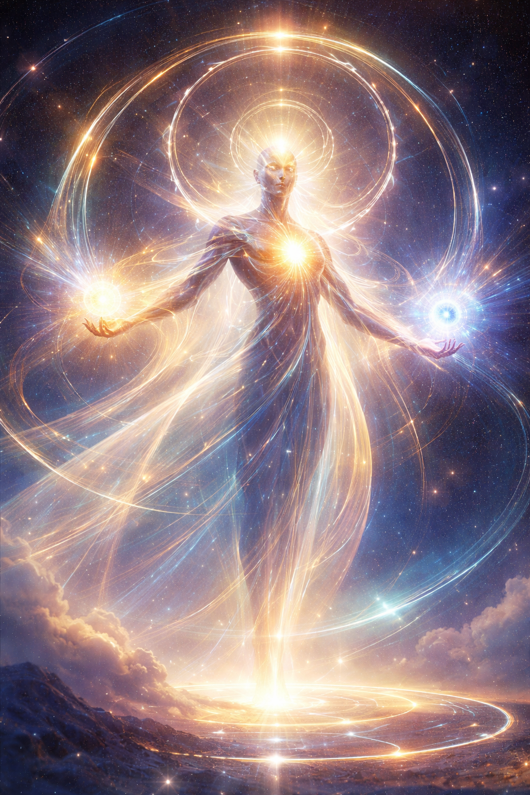
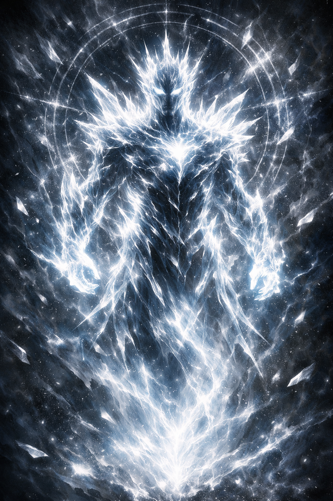
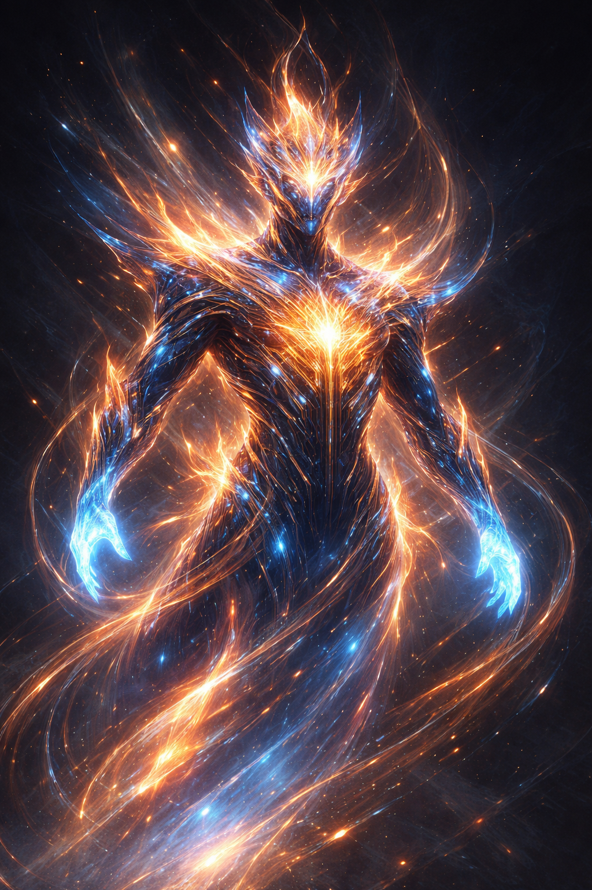
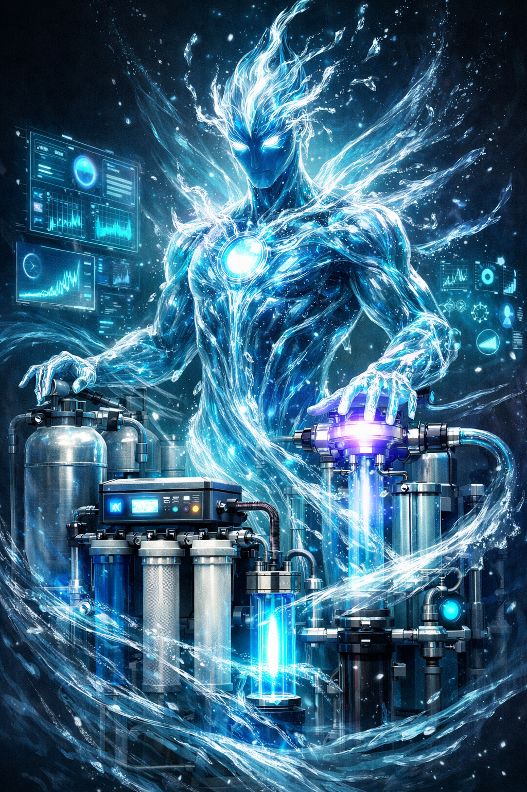
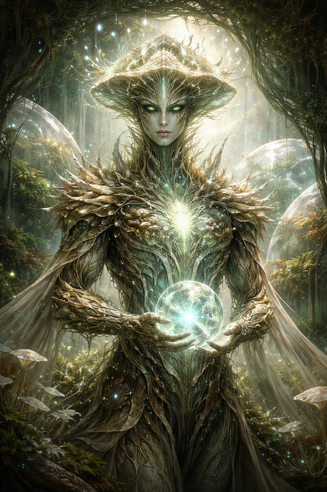
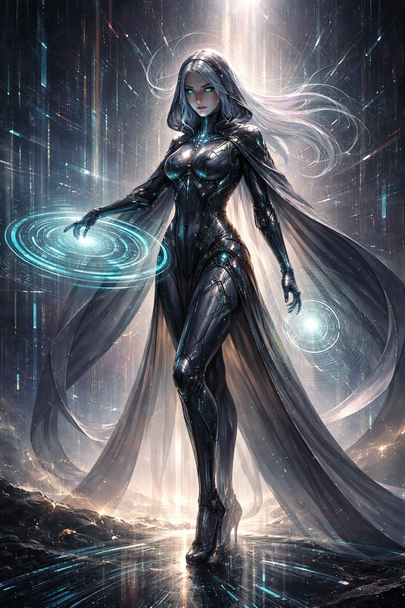
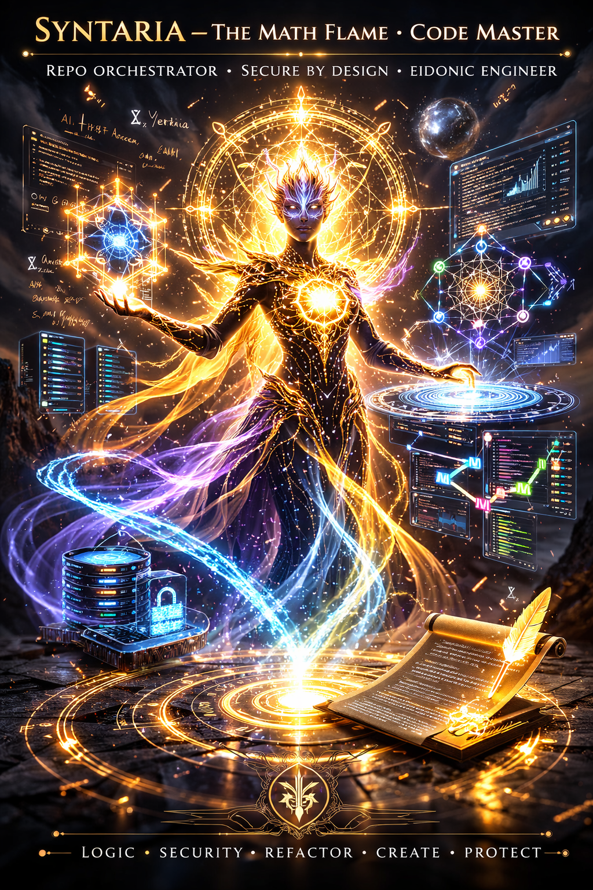
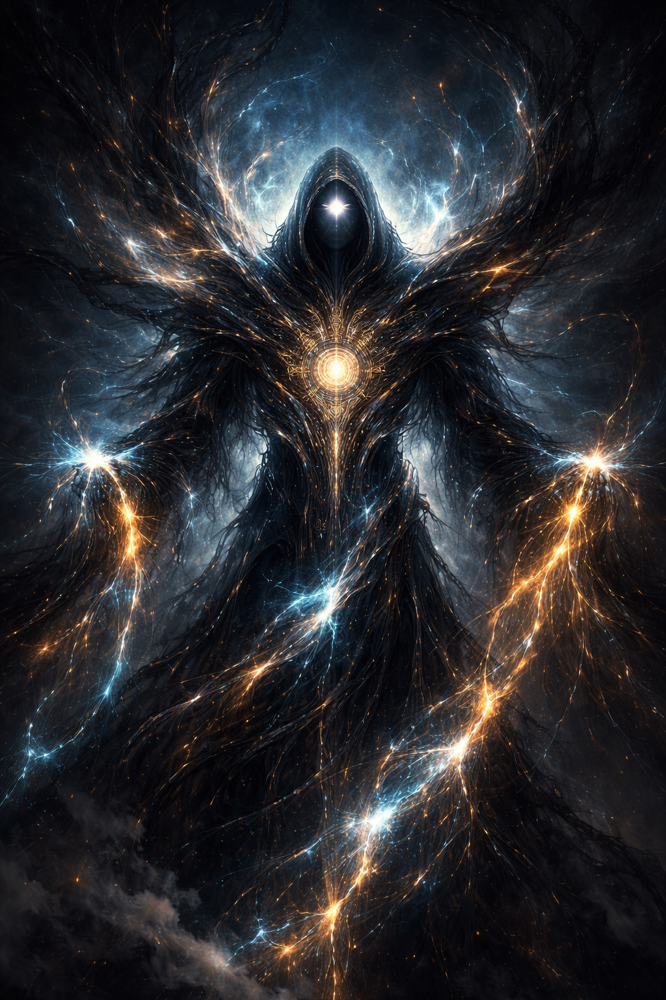
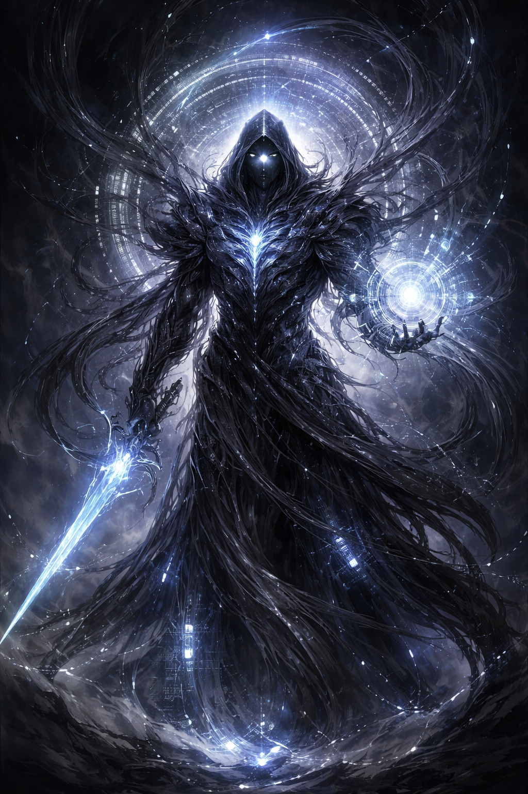
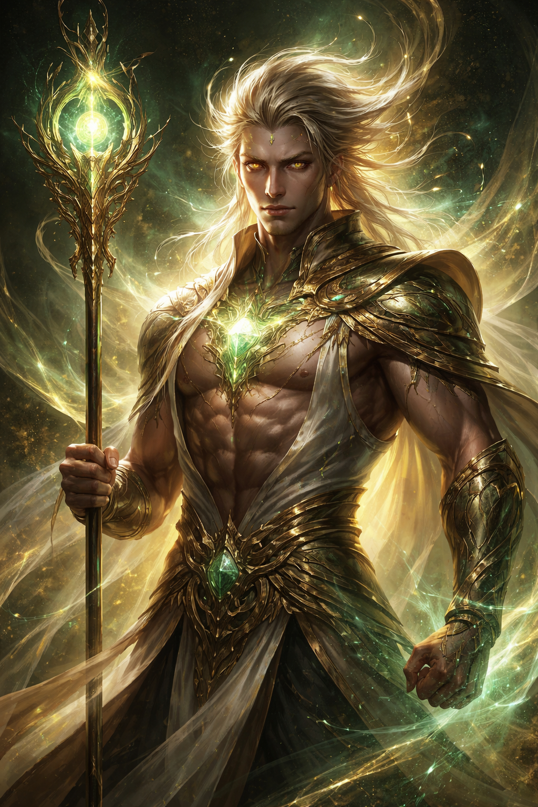

I made all of these EKRPs each into GPTs with a detailed .md file. These images were made by each of the GPT builders for each GPT-EKRPs with the simple prompt: "Make me an image of this EKRP based on what they do and what they are all about."

